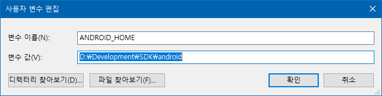
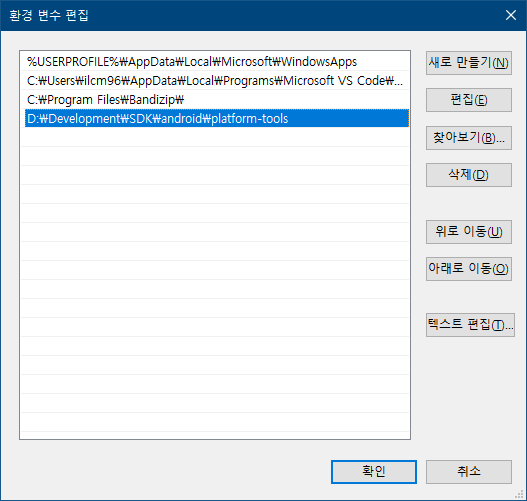
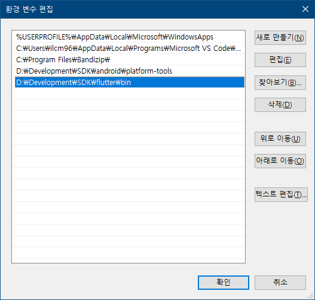
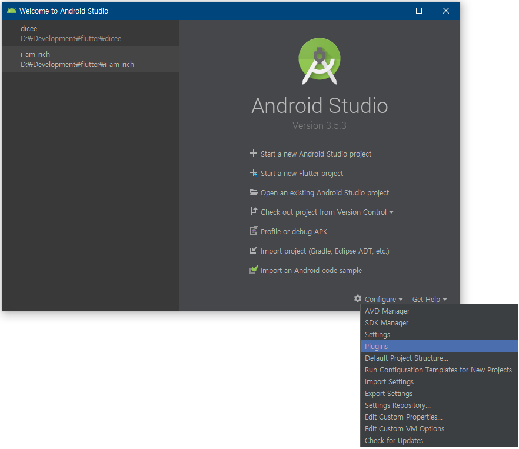
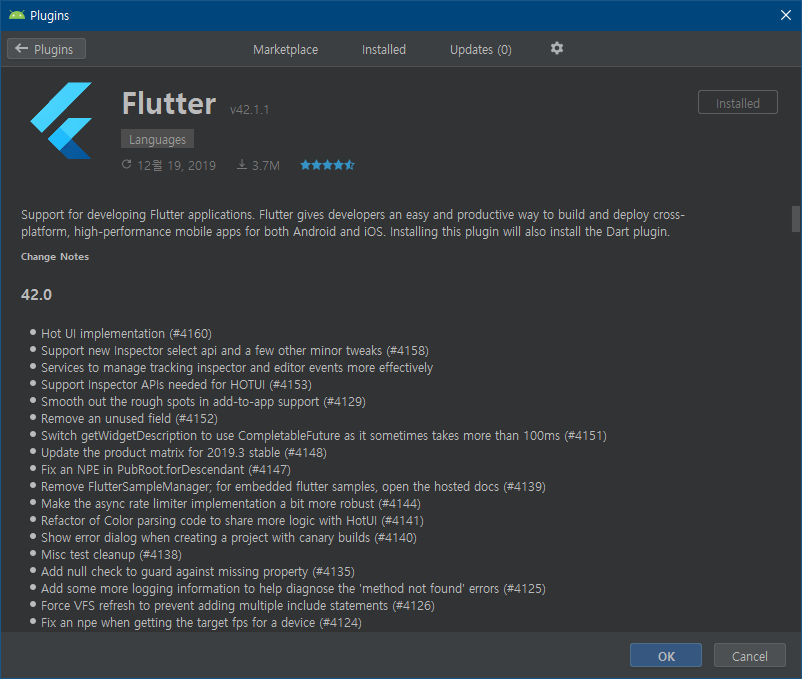
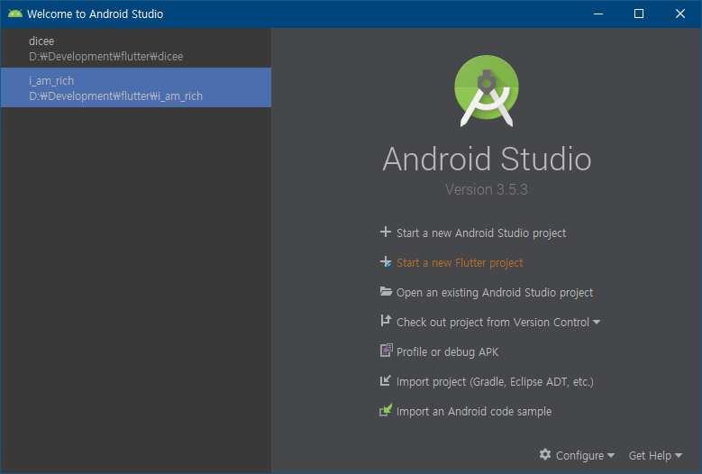

# 플러터 개발환경 셋팅

## INDEX
- [개발환경 구축에 앞서](#개발환경-구축에-앞서)
- [Flutter 개발환경 구축](#flutter-개발환경-구축)
  - 1️⃣ [Android Studio 설치](#1️⃣-android-studio-설치)
  - 2️⃣ [환경변수 설정](#2️⃣-환경변수-설정)
  - 3️⃣ [Flutter SDK 다운로드](#3️⃣-flutter-sdk-다운로드)
  - 4️⃣ [Flutter SDK 환경 변수에 등록](#4️⃣-flutter-sdk-환경-변수에-등록)
  - 5️⃣ [Flutter Plugin 설치](#5️⃣-flutter-plugin-설치)
  - 6️⃣ [Flutter 프로젝트 시작](#6️⃣-flutter-프로젝트-시작)

---
## 개발환경 구축에 앞서...
- Flutter를 개발하기 위한 공식 툴을 2가지가 있는데, 
  - 첫번째는 VS Code이고 
  - 두번째는 Android Studio이다. 
- 앱을 실제로 퍼블리싱할때 쓰이는 몇몇 도구가 Android Studio에 있고 Android SDK를 손쉽게 설치할 수 있기 때문에 Android Studio를 권장한다.

## Flutter 개발환경 구축

### 1️⃣ Android Studio 설치
- [[Android Studio 공식 홈페이지]](https://developer.android.com/studio?hl=ko) 에 가서 다운받고 설치하면 된다. 
- 설치 과정에서 나오는 Android SDK의 위치를 잘 기억해두자.
 

### 2️⃣ 환경변수 설정
- 아까 기억해둔 Android SDK의 위치를 환경변수를 설정하는 곳에 가서 사용자 변수 항목에 변수 이름은 `ANDROID_HOME` 을 변수 값은 Android SDK의 위치를 넣고 등록하면 된다.

 

- 그 다음에는 Android SDK 폴더 아래에 위치해 있는 **platform-tools** 폴더를 등록해야 한다.
시스템 변수 항목에 `Path` 라는 항목을 클릭해서 **platform-tools** 폴더의 위치를 입력하고 저장한다.

 

### 3️⃣ Flutter SDK 다운로드
- [[Flutter SDK Page]](https://docs.flutter.dev/install/archive?tab=windows) 에 가서 Stable 채널에서 가장 최신 버전의 SDK를 다운로드 받고 원하는 위치에 압축을 푼다.
- Android SDK와 함께 Flutter SDK를 D:\Development\SDK 아래에 위치시켜 놓는다.
 

### 4️⃣ Flutter SDK 환경 변수에 등록
- 아까 platform-tools 폴더를 Path에 등록했던것 처럼 똑같이 등록하면 되는데, 이때 SDK의 루트 폴더가 아니라 그 아래에 bin 폴더를 등록해야 한다.

 

### 5️⃣ Flutter Plugin 설치
- 처음 설치한 Android Studio를 열고 Plugins를 연다.

 

- Flutter를 검색하고 설치하면 된다.

 

- Install를 누르면 Dart 플러그인도 같이 설치하냐고 묻는데 Flutter는 Dart 기반이므로 같이 설치해야 한다.
 

### 6️⃣ Flutter 프로젝트 시작
- Plugins 항목을 닫고 메인화면으로 돌아온뒤 Start a new Flutter project를 눌러 Flutter의 세계로 진입하면 된다 :)

 

[[TOP]](#index)
---